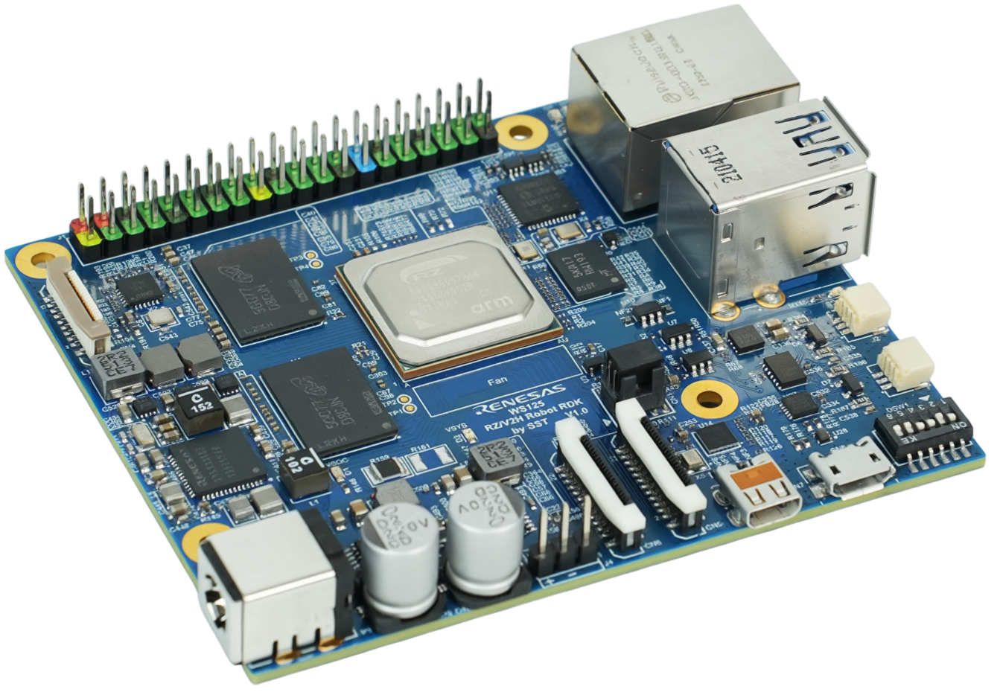

# Renesas Repositories for RZ/V2H Robotic Development Kit (RDK)

Open-source ROS 2 packages and tools for building robotics applications on the **Renesas RZ/V2H** platform with DRP-AI hardware acceleration.

  

## Online Resources

**Renesas Official RZ/V2H RDK Website**: [WS125-V2HRDKREFZ](https://www.renesas.com/ws125-v2hrdkrefz)

**User Manual**: [RZ/V2H RDK Documentation (Online)](https://renesas-rdk.github.io/rzv2h_rdk_documentation/latest/index.html)

---

## Quick Navigation

| Category | What's Inside |
|---|---|
| [**Linux Kernel & Build Tools**](#linux-kernel--build-tools) | Linux kernel sources, device tree support, BSP/build system integration, cross-compilation tools |
| [**AI Models & Apps**](#ai-models-drp-ai) | DRP-AI inference, object detection, pose estimation, ROS 2 integration |
| [**Robot Hardware**](#robot-hardware) | Piper Arm, SO ARM101, INSPIRE RH56 Hand, RuiYan RH2 Hand, combined systems |
| [**Demos & Simulation**](#demos) | End-to-end demos, MuJoCo simulation |
| [**Firmware, Tools & Docs**](#rzv2h-firmware--rtos) | RTOS demos, drivers, utilities, documentation |

> [!NOTE]
> Click on the **triangular arrows** (&#9654;) next to each section below to expand and view the repository list.

---

## Linux Kernel & Build Tools

Linux kernel sources and build utilities for RZ/V2H RDK development.

<table>
<tr>
<th> Repository </th>
<th> URL </th>
<th> Description </th>
</tr>
<tr>
 <td> linux-rz </td>
 <td> https://github.com/Renesas-SST/linux-rz/tree/ubuntu/rz-v2h-rdk </td>
 <td> Linux kernel source for the RZ/V2H RDK platform </td>
</tr>
<tr>
 <td> rz-utils </td>
 <td> https://github.com/Renesas-SST/rz-utils/tree/ubuntu/rz-v2h-rdk </td>
 <td> Collection of utilities for various workflows related to Renesas RZ-based devices </td>
</tr>
</table>

---

## AI Models (DRP-AI)

C++ packages for running AI inference on Renesas RZ/V processors with DRP-AI acceleration.

<table>
<tr>
<th> Repository </th>
<th> URL </th>
<th> Description </th>
</tr>
<tr>
 <td> rzv_model </td>
 <td> https://github.com/renesas-rdk/rzv_model </td>
 <td> DRP-AI model abstractions and implementations for RZ/V platforms </td>
</tr>
<tr>
 <td> rzv_yolox </td>
 <td> https://github.com/renesas-rdk/rzv_yolox </td>
 <td> YOLOX object detection </td>
</tr>
<tr>
 <td> rzv_yolov8 </td>
 <td> https://github.com/renesas-rdk/rzv_yolov8 </td>
 <td> YOLOv8 object detection </td>
</tr>
<tr>
 <td> rzv_gold_yolo </td>
 <td> https://github.com/renesas-rdk/rzv_gold_yolo </td>
 <td> Gold-YOLO object detection </td>
</tr>
<tr>
 <td> rzv_rtmpose </td>
 <td> https://github.com/renesas-rdk/rzv_rtmpose </td>
 <td> RTMPose pose detection </td>
</tr>
<tr>
 <td> rzv_mediapipe </td>
 <td> https://github.com/renesas-rdk/rzv_mediapipe </td>
 <td> MediaPipe pose detection </td>
</tr>
<tr>
 <td> rzv_hrnetv2 </td>
 <td> https://github.com/renesas-rdk/rzv_hrnetv2 </td>
 <td> HRNetV2 pose detection </td>
</tr>
<tr>
 <td> rzv_model_evaluation </td>
 <td> https://github.com/renesas-rdk/rzv_model_evaluation </td>
 <td> Model evaluation with standard object detection metrics </td>
</tr>
<tr>
 <td> hand_models </td>
 <td> https://github.com/renesas-rdk/hand_models </td>
 <td> Hand detection & pose estimation model conversion (MMPose to ONNX) </td>
</tr>
</table>

## AI Applications (ROS 2)

ROS 2 nodes that integrate AI models into robotics pipelines.

<table>
<tr>
<th> Repository </th>
<th> URL </th>
<th> Description </th>
</tr>
<tr>
 <td> rzv_object_detection </td>
 <td> https://github.com/renesas-rdk/rzv_object_detection </td>
 <td> Object detection nodes for static image and camera-based inference </td>
</tr>
<tr>
 <td> rzv_pose_estimation </td>
 <td> https://github.com/renesas-rdk/rzv_pose_estimation </td>
 <td> Hand landmark estimation combining hand detection with landmark analysis </td>
</tr>
<tr>
 <td> rzv_model_utils_ros2 </td>
 <td> https://github.com/renesas-rdk/rzv_model_utils_ros2 </td>
 <td> Utility library for integrating AI models into ROS 2 applications </td>
</tr>
</table>

---

## Robot Hardware

<b>AgileX Piper Arm</b> — 6-DOF robotic arm

<table>
<tr>
<th> Repository </th>
<th> URL </th>
<th> Description </th>
</tr>
<tr>
 <td> agilex_piper_arm_bringup </td>
 <td> https://github.com/renesas-rdk/agilex_piper_arm_bringup </td>
 <td> Bringup and operation of the Piper arm and gripper </td>
</tr>
<tr>
 <td> agilex_piper_ros2_control </td>
 <td> https://github.com/renesas-rdk/agilex_piper_ros2_control </td>
 <td> ros2_control hardware interface for the Piper arm and gripper </td>
</tr>
<tr>
 <td> agilex_piper_arm_description </td>
 <td> https://github.com/renesas-rdk/agilex_piper_arm_description </td>
 <td> URDF description files </td>
</tr>
<tr>
 <td> agilex_piper_controller </td>
 <td> https://github.com/renesas-rdk/agilex_piper_controller </td>
 <td> C++ controller (ported from original Python SDK) </td>
</tr>
<tr>
 <td> agilex_piper_utils </td>
 <td> https://github.com/renesas-rdk/agilex_piper_utils </td>
 <td> Utility nodes for message conversion and pose transformations </td>
</tr>
<tr>
 <td> agilex_piper_mujoco </td>
 <td> https://github.com/renesas-rdk/agilex_piper_mujoco </td>
 <td> MuJoCo simulation with ros2_control integration </td>
</tr>
</table>

<b>SO ARM101</b> — 6-DOF arm with STS3215 servo motors

<table>
<tr>
<th> Repository </th>
<th> URL </th>
<th> Description </th>
</tr>
<tr>
 <td> so_arm101_bringup </td>
 <td> https://github.com/renesas-rdk/so_arm101_bringup </td>
 <td> Bringup with launch files, controller configs, and test scripts </td>
</tr>
<tr>
 <td> so_arm101_ros2_control </td>
 <td> https://github.com/renesas-rdk/so_arm101_ros2_control </td>
 <td> ros2_control hardware interface </td>
</tr>
<tr>
 <td> so_arm101_description </td>
 <td> https://github.com/renesas-rdk/so_arm101_description </td>
 <td> URDF and XACRO description files </td>
</tr>
<tr>
 <td> so_arm101_utils </td>
 <td> https://github.com/renesas-rdk/so_arm101_utils </td>
 <td> Utility nodes for message adaptation and conversion </td>
</tr>
</table>

<b>INSPIRE RH56 Hand</b> — 6-DOF dexterous hand

<table>
<tr>
<th> Repository </th>
<th> URL </th>
<th> Description </th>
</tr>
<tr>
 <td> inspire_rh56_hand_bringup </td>
 <td> https://github.com/renesas-rdk/inspire_rh56_hand_bringup </td>
 <td> Bringup and operation </td>
</tr>
<tr>
 <td> inspire_rh56_hand_ros2_control </td>
 <td> https://github.com/renesas-rdk/inspire_rh56_hand_ros2_control </td>
 <td> ros2_control hardware interface via serial connection </td>
</tr>
<tr>
 <td> inspire_rh56_hand_description </td>
 <td> https://github.com/renesas-rdk/inspire_rh56_hand_description </td>
 <td> URDF description files </td>
</tr>
<tr>
 <td> inspire_rh56_dexhand </td>
 <td> https://github.com/renesas-rdk/inspire_rh56_dexhand </td>
 <td> Hardware interface for controlling the RH56 hand </td>
</tr>
<tr>
 <td> inspire_rh56_hand_utils </td>
 <td> https://github.com/renesas-rdk/inspire_rh56_hand_utils </td>
 <td> Gripper action adapter with configurable joint mapping </td>
</tr>
<tr>
 <td> inspire_rh56_urdf </td>
 <td> https://github.com/renesas-rdk/inspire_rh56_urdf </td>
 <td> URDF models and visualization tools (left/right configurations) </td>
</tr>
</table>

<b>RuiYan RH2 Hand</b> — 6-DOF dexterous hand

<table>
<tr>
<th> Repository </th>
<th> URL </th>
<th> Description </th>
</tr>
<tr>
 <td> ruiyan_rh2_hand_bringup </td>
 <td> https://github.com/renesas-rdk/ruiyan_rh2_hand_bringup </td>
 <td> Bringup and operation </td>
</tr>
<tr>
 <td> ruiyan_rh2_hand_ros2_control </td>
 <td> https://github.com/renesas-rdk/ruiyan_rh2_hand_ros2_control </td>
 <td> ros2_control hardware interface via CAN bus </td>
</tr>
<tr>
 <td> ruiyan_rh2_hand_description </td>
 <td> https://github.com/renesas-rdk/ruiyan_rh2_hand_description </td>
 <td> URDF description files </td>
</tr>
<tr>
 <td> ruiyan_rh2_dexhand </td>
 <td> https://github.com/renesas-rdk/ruiyan_rh2_dexhand </td>
 <td> JointState to Rh6Cmd converter for hand control </td>
</tr>
<tr>
 <td> ruiyan_rh2_controller </td>
 <td> https://github.com/renesas-rdk/ruiyan_rh2_controller </td>
 <td> Controller adaptation for ARM64 targets </td>
</tr>
<tr>
 <td> ruiyan_rh2_urdf </td>
 <td> https://github.com/renesas-rdk/ruiyan_rh2_urdf </td>
 <td> URDF models and visualization tools (left/right configurations) </td>
</tr>
</table>

<b>Arm + Hand Systems</b> — Combined arm and hand packages

<table>
<tr>
<th> Repository </th>
<th> URL </th>
<th> Description </th>
</tr>
<tr>
 <td> piper_arm_inspire_hand_bringup </td>
 <td> https://github.com/renesas-rdk/piper_arm_inspire_hand_bringup </td>
 <td> AgileX Piper arm + INSPIRE RH56 hand bringup </td>
</tr>
<tr>
 <td> piper_arm_ruiyan_hand_bringup </td>
 <td> https://github.com/renesas-rdk/piper_arm_ruiyan_hand_bringup </td>
 <td> AgileX Piper arm + RuiYan RH2 hand bringup </td>
</tr>
<tr>
 <td> arm_hand_control </td>
 <td> https://github.com/renesas-rdk/arm_hand_control </td>
 <td> Robotic hand control through gesture recognition and landmark tracking </td>
</tr>
</table>

---

## Demos

End-to-end demonstration packages showcasing the platform capabilities.

<table>
<tr>
<th> Repository </th>
<th> URL </th>
<th> Description </th>
</tr>
<tr>
 <td> rzv_playground </td>
 <td> https://github.com/renesas-rdk/rzv_playground </td>
 <td> Demonstration and teleoperation launch files for arm and hand systems </td>
</tr>
<tr>
 <td> rzv_demo_dexhand </td>
 <td> https://github.com/renesas-rdk/rzv_demo_dexhand </td>
 <td> Dexterous hand control with vision-based pose estimation </td>
</tr>
<tr>
 <td> rzv_demo_rps </td>
 <td> https://github.com/renesas-rdk/rzv_demo_rps </td>
 <td> Rock-paper-scissors gesture recognition translated into control commands </td>
</tr>
</table>

## Simulation (MuJoCo)

Physics simulation and ros2_control integration.

<table>
<tr>
<th> Repository </th>
<th> URL </th>
<th> Description </th>
</tr>
<tr>
 <td> mujoco </td>
 <td> https://github.com/renesas-rdk/mujoco </td>
 <td> MuJoCo general-purpose physics simulator </td>
</tr>
<tr>
 <td> mujoco_sim_ros2 </td>
 <td> https://github.com/renesas-rdk/mujoco_sim_ros2 </td>
 <td> MuJoCo simulate app with ROS 2 integration </td>
</tr>
<tr>
 <td> mujoco_ros2_control </td>
 <td> https://github.com/renesas-rdk/mujoco_ros2_control </td>
 <td> MuJoCo ros2_control plugin </td>
</tr>
</table>

---

## RZ/V2H Firmware & RTOS

RTOS demos for the RZ/V2H multi-core processors (CR8, CM33).

<table>
<tr>
<th> Repository </th>
<th> URL </th>
<th> Description </th>
</tr>
<tr>
 <td> rzv2h_rdk_blinky </td>
 <td> https://github.com/renesas-rdk/rzv2h_rdk_blinky </td>
 <td> LED blinky example for basic board validation </td>
</tr>
<tr>
 <td> rzv2h_rdk_cm33_rpmsg_linux_rtos_demo </td>
 <td> https://github.com/renesas-rdk/rzv2h_rdk_cm33_rpmsg_linux_rtos_demo </td>
 <td> CM33 RPMsg Linux-RTOS communication demo </td>
</tr>
<tr>
 <td> rzv2h_rdk_cr8_core0_rpmsg_linux_rtos_demo </td>
 <td> https://github.com/renesas-rdk/rzv2h_rdk_cr8_core0_rpmsg_linux_rtos_demo </td>
 <td> CR8 Core0 RPMsg Linux-RTOS communication demo </td>
</tr>
<tr>
 <td> rzv2h_rdk_cr8_core0_rpmsg_microros_demo </td>
 <td> https://github.com/renesas-rdk/rzv2h_rdk_cr8_core0_rpmsg_microros_demo </td>
 <td> CR8 Core0 micro-ROS communication via OpenAMP </td>
</tr>
<tr>
 <td> Micro-XRCE-DDS-Agent </td>
 <td> https://github.com/renesas-rdk/Micro-XRCE-DDS-Agent </td>
 <td> Micro XRCE-DDS Agent for micro-ROS communication </td>
</tr>
</table>

## Tools & Utilities

Supporting tools, drivers, and middleware.

<table>
<tr>
<th> Repository </th>
<th> URL </th>
<th> Description </th>
</tr>
<tr>
 <td> rzv2h_opencv_accelerated_debs </td>
 <td> https://github.com/renesas-rdk/rzv2h_opencv_accelerated_debs </td>
 <td> OpenCV 4.6.0 with DRP hardware acceleration (.deb packages, Ubuntu 24.04 ARM64) </td>
</tr>
<tr>
 <td> foxglove_keypoint_publisher </td>
 <td> https://github.com/renesas-rdk/foxglove_keypoint_publisher </td>
 <td> Publish keypoints/landmarks/bounding boxes as Foxglove image annotations </td>
</tr>
<tr>
 <td> cartesian_controllers </td>
 <td> https://github.com/renesas-rdk/cartesian_controllers </td>
 <td> Cartesian controllers for the ROS 2 control framework </td>
</tr>
</table>

## Documentation & Workspace

Project documentation and workspace configuration.

<table>
<tr>
<th> Repository </th>
<th> URL </th>
<th> Description </th>
</tr>
<tr>
 <td> rzv2h_rdk_documentation </td>
 <td> https://github.com/renesas-rdk/rzv2h_rdk_documentation </td>
 <td> User manual and technical documentation for the RDK </td>
</tr>
<tr>
 <td> ros2_demo_workspace </td>
 <td> https://github.com/renesas-rdk/ros2_demo_workspace </td>
 <td> Workspace manifests and common utilities for ROS 2 demos </td>
</tr>
</table>

