<!--
  Maintainer notes - adding a new board:
    1. Add a column to "Supported Boards", "Sample Applications" and "Key Repositories > Platform-Specific".
    2. Put a transparent, cropped board photo (~640 px wide) in images/boards/.
    3. Follow the naming convention below (<family>_<function> for board-specific repos).
    4. Add the board's manifests under ros2_demo_workspace/vcs_manifests/<board>/.
  Platform-neutral repositories need no change unless their support status differs.
-->

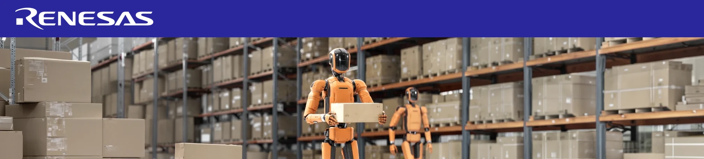

# Renesas Robotics & Edge-AI Development Platforms

Open-source ROS 2 packages, AI model libraries, BSP sources, and tools for building robotics applications on **Renesas development boards**.

Most application, robot-hardware, and simulation packages are **platform-neutral** and shared across boards. Only the BSP, the AI inference backend, and a few board-specific features differ per board.

## 🖥️ Supported Boards

> [!IMPORTANT]
> **Start here.** Pick your board, grab the **latest release**, and follow the **Quick Setup Guide** to boot Ubuntu and run your first sample application.

<table>
<tr>
<td width="50%" align="center" valign="top">

<h3>RZ/V2H Robotic Development Kit (RDK)</h3>

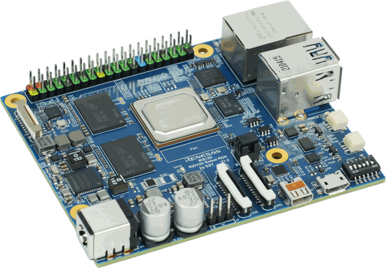

 

</td>
<td width="50%" align="center" valign="top">

<h3>R-Car V4H Sparrow Hawk (SH)</h3>

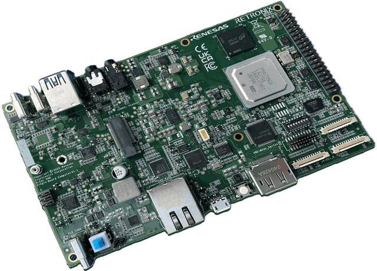

 

</td>
</tr>
<tr>
<td valign="top">

⚙️ <b>SoC:</b> RZ/V2H - 4× Cortex-A55, 2× Cortex-R8, Cortex-M33 
🧠 <b>AI:</b> DRP-AI3, 8 dense / 80 sparse TOPS 
🐧 <b>OS:</b> Ubuntu 24.04 · ROS 2 Jazzy

<b>🚀 Get started</b>

<ol>
<li>📥 Download the <b>Software Package</b> from the <a href="https://github.com/renesas-rdk/rzv2h_rdk_documentation/releases/latest">latest release</a></li>
<li>💾 Flash and boot the board - <a href="https://renesas-rdk.github.io/rzv2h_rdk_documentation/latest/chapter-1/quick_setup_guide.html">Quick Setup Guide</a></li>
<li>🛠️ Set up cross-compilation - <a href="https://renesas-rdk.github.io/rzv2h_rdk_documentation/latest/chapter-4/development_guide/cross_build_overview.html">Cross-build Guide</a></li>
<li>🧩 Build a sample application - <a href="https://github.com/renesas-rdk/ros2_demo_workspace/tree/main/vcs_manifests/rz-v2h">workspace manifests</a></li>
</ol>

📦 <a href="https://www.renesas.com/ws125-v2hrdkrefz">Product page</a> · 📝 <a href="https://github.com/renesas-rdk/rzv2h_rdk_documentation/releases">All releases</a>

</td>
<td valign="top">

⚙️ <b>SoC:</b> R-Car V4H - 4× Cortex-A76, 3× Cortex-R52 
🧠 <b>AI:</b> 29.5 dense TOPS 
🐧 <b>OS:</b> Ubuntu 24.04 · ROS 2 Jazzy

<b>🚀 Get started</b>

<ol>
<li>📥 Download the <b>Software Package</b> from the <a href="https://github.com/renesas-rdk/rcarv4h_sh_documentation/releases/latest">latest release</a></li>
<li>💾 Flash and boot the board - <a href="https://renesas-rdk.github.io/rcarv4h_sh_documentation/latest/chapter-1/quick_setup_guide/quick_setup_guide.html">Quick Setup Guide</a></li>
<li>🛠️ Set up cross-compilation - <a href="https://renesas-rdk.github.io/rcarv4h_sh_documentation/latest/chapter-4/development_guide/cross_build_overview.html">Cross-build Guide</a></li>
<li>🧩 Build a sample application - <a href="https://github.com/renesas-rdk/ros2_demo_workspace/tree/main/vcs_manifests/rcar-v4h">workspace manifests</a></li>
</ol>

📦 <a href="https://www.renesas.com/en/design-resources/partners/retronix/sparrow-hawk-r-car-v4h-high-performance-ai-single-board-computer-sbc">Product page</a> · 📝 <a href="https://github.com/renesas-rdk/rcarv4h_sh_documentation/releases">All releases</a>

</td>
</tr>
</table>

---

## 🎬 Sample Applications

<table>
<tr>
<td align="center">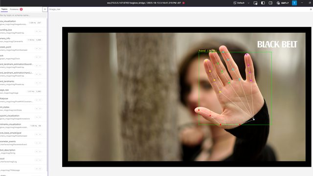 Hand Landmark Estimation</td>
<td align="center">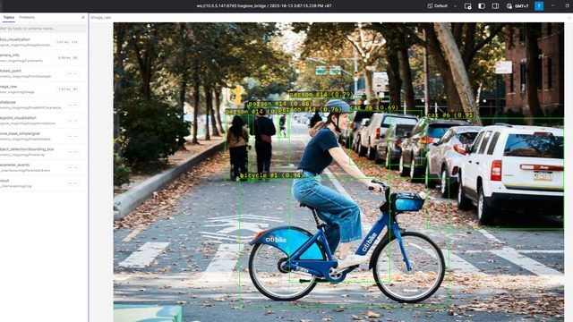 Static Object Detection</td>
<td align="center">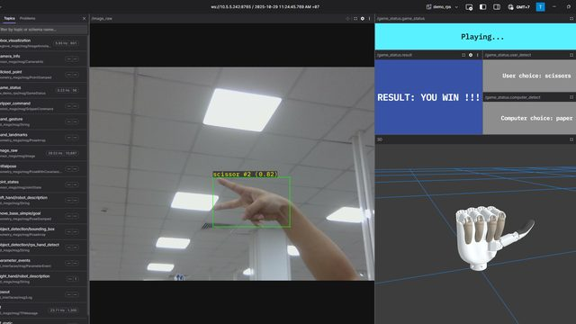 Rock-Paper-Scissors</td>
<td align="center">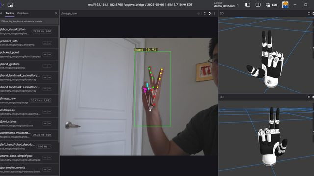 Vision-Based Dexterous Hand</td>
</tr>
<tr>
<td align="center">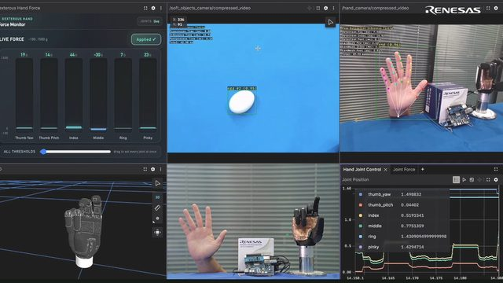 Dexterous Hand with Sensors</td>
<td align="center">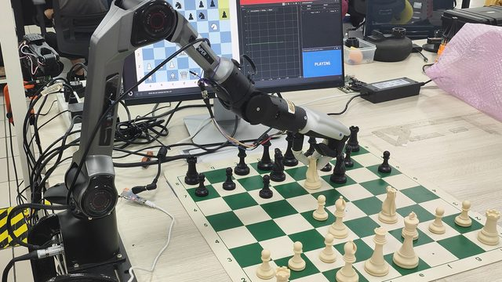 Queen's Hand (Chess Robot)</td>
<td align="center">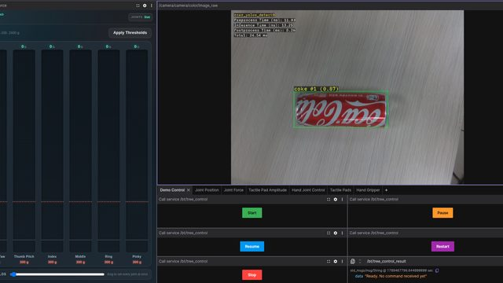 Vision-Based Grasping</td>
<td align="center">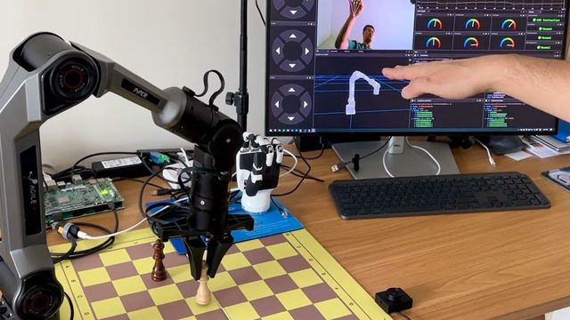 Robotic Arm Teleoperation</td>
</tr>
</table>

Each cell links to the sample application guide in the board's User Manual and to the `vcs` manifest that pins every repository needed to build it (import with `vcs import src < <manifest>`).

| Sample application | Main package | RZ/V2H RDK | R-Car V4H SH |
|---|---|:---:|:---:|
| Hand Landmark Estimation | `*_pose_estimation` | ✅ [Guide](https://renesas-rdk.github.io/rzv2h_rdk_documentation/latest/chapter-4/sample_apps/hand_landmark.html) · [Manifest](https://github.com/renesas-rdk/ros2_demo_workspace/blob/main/vcs_manifests/rz-v2h/hand_landmark_estimation.target.lock.repos) | ✅ [Guide](https://renesas-rdk.github.io/rcarv4h_sh_documentation/latest/chapter-4/sample_apps/hand_landmark.html) · [Manifest](https://github.com/renesas-rdk/ros2_demo_workspace/blob/main/vcs_manifests/rcar-v4h/hand_landmark_estimation.target.lock.repos) |
| Static Object Detection | `*_object_detection` | ✅ [Guide](https://renesas-rdk.github.io/rzv2h_rdk_documentation/latest/chapter-4/sample_apps/static_object_detection.html) · [Manifest](https://github.com/renesas-rdk/ros2_demo_workspace/blob/main/vcs_manifests/rz-v2h/static_object_detection.target.lock.repos) | ✅ [Guide](https://renesas-rdk.github.io/rcarv4h_sh_documentation/latest/chapter-4/sample_apps/static_object_detection.html) · [Manifest](https://github.com/renesas-rdk/ros2_demo_workspace/blob/main/vcs_manifests/rcar-v4h/static_object_detection.target.lock.repos) |
| Rock-Paper-Scissors | [renesas_demo_rps](https://github.com/renesas-rdk/renesas_demo_rps) | ✅ [Guide](https://renesas-rdk.github.io/rzv2h_rdk_documentation/latest/chapter-4/sample_apps/rock_paper_scissors.html) · [Manifest](https://github.com/renesas-rdk/ros2_demo_workspace/blob/main/vcs_manifests/rz-v2h/rock_paper_scissors.target.lock.repos) | ✅ [Guide](https://renesas-rdk.github.io/rcarv4h_sh_documentation/latest/chapter-4/sample_apps/rock_paper_scissors.html) · [Manifest](https://github.com/renesas-rdk/ros2_demo_workspace/blob/main/vcs_manifests/rcar-v4h/rock_paper_scissors.target.lock.repos) |
| Vision-Based Dexterous Hand | [renesas_demo_dexhand](https://github.com/renesas-rdk/renesas_demo_dexhand) | ✅ [Guide](https://renesas-rdk.github.io/rzv2h_rdk_documentation/latest/chapter-4/sample_apps/dexhand.html) · [Manifest](https://github.com/renesas-rdk/ros2_demo_workspace/blob/main/vcs_manifests/rz-v2h/vision_based_dexterous_hand.target.lock.repos) | ✅ [Guide](https://renesas-rdk.github.io/rcarv4h_sh_documentation/latest/chapter-4/sample_apps/dexhand.html) · [Manifest](https://github.com/renesas-rdk/ros2_demo_workspace/blob/main/vcs_manifests/rcar-v4h/vision_based_dexterous_hand.target.lock.repos) |
| Dexterous Hand with Sensors | [renesas_demo_dexhand_w_sensors](https://github.com/renesas-rdk/renesas_demo_dexhand_w_sensors) | ✅ [Guide](https://renesas-rdk.github.io/rzv2h_rdk_documentation/latest/chapter-4/sample_apps/dexhand_with_sensors.html) · [Manifest](https://github.com/renesas-rdk/ros2_demo_workspace/blob/main/vcs_manifests/rz-v2h/vision_based_dexterous_hand_with_sensors.target.lock.repos) | ✅ [Guide](https://renesas-rdk.github.io/rcarv4h_sh_documentation/latest/chapter-4/sample_apps/dexhand_with_sensors.html) · [Manifest](https://github.com/renesas-rdk/ros2_demo_workspace/blob/main/vcs_manifests/rcar-v4h/vision_based_dexterous_hand_with_sensors.target.lock.repos) |
| Queen's Hand (Chess Robot) | [renesas_demo_queens_hand](https://github.com/renesas-rdk/renesas_demo_queens_hand) | ✅ [Guide](https://renesas-rdk.github.io/rzv2h_rdk_documentation/latest/chapter-4/sample_apps/queens_hand.html) · [Manifest](https://github.com/renesas-rdk/ros2_demo_workspace/blob/main/vcs_manifests/rz-v2h/queens_hand.target.lock.repos) | ✅ [Guide](https://renesas-rdk.github.io/rcarv4h_sh_documentation/latest/chapter-4/sample_apps/queens_hand.html) · [Manifest](https://github.com/renesas-rdk/ros2_demo_workspace/blob/main/vcs_manifests/rcar-v4h/queens_hand.target.lock.repos) |
| Vision-Based Grasping | [renesas_vision_based_grasping](https://github.com/renesas-rdk/renesas_vision_based_grasping) | ✅ [Guide](https://renesas-rdk.github.io/rzv2h_rdk_documentation/latest/chapter-4/sample_apps/vision_based_grasping.html) · [Manifest](https://github.com/renesas-rdk/ros2_demo_workspace/blob/main/vcs_manifests/rz-v2h/vision_based_grasping.target.lock.repos) | ✅ [Guide](https://renesas-rdk.github.io/rcarv4h_sh_documentation/latest/chapter-4/sample_apps/vision_based_grasping.html) · [Manifest](https://github.com/renesas-rdk/ros2_demo_workspace/blob/main/vcs_manifests/rcar-v4h/vision_based_grasping.target.lock.repos) |
| Robotic Arm Teleoperation | [rzv_playground](https://github.com/renesas-rdk/rzv_playground) | ✅ [Guide](https://renesas-rdk.github.io/rzv2h_rdk_documentation/latest/chapter-4/sample_apps/arm_teleoperation.html) · [Target](https://github.com/renesas-rdk/ros2_demo_workspace/blob/main/vcs_manifests/rz-v2h/vision_based_robotic_arm_teleoperation.target.lock.repos) / [Host](https://github.com/renesas-rdk/ros2_demo_workspace/blob/main/vcs_manifests/rz-v2h/vision_based_robotic_arm_teleoperation.host.lock.repos) manifests | - |
| Drone Autopilot (PX4 on FreeRTOS) | [rzv2h_drone_px4](https://github.com/renesas-rdk/rzv2h_drone_px4) | ✅ [README](https://github.com/renesas-rdk/rzv2h_drone_px4/blob/main/README.md) | - |

---

## 📚 Key Repositories

A selection of the most commonly used repositories. Browse [all repositories](https://github.com/orgs/renesas-rdk/repositories) for the complete list.

> [!TIP]
> 🏷️ **Repository naming convention**
> - `rzv_*` - RZ/V specific
> - `rcar_*` - R-Car V4H specific
> - `renesas_*` and all other names - platform-neutral, works on every supported board

### 🔧 Platform-Specific

| Function | RZ/V2H RDK | R-Car V4H SH |
|---|---|---|
| 🐧 Linux kernel | [linux-rz](https://github.com/renesas-rdk/linux-rz/tree/ubuntu/rz-v2h-rdk) | [linux-sh](https://github.com/renesas-rdk/linux-sh/tree/ubuntu/rcar-v4h-sh) |
| 🛠️ BSP build & deploy utilities | [rz-utils](https://github.com/renesas-rdk/rz-utils/tree/ubuntu/rz-v2h-rdk) | [rcar-utils](https://github.com/renesas-rdk/rcar-utils/tree/ubuntu/rcar-v4h-sh) |
| 🧠 AI model base library | [rzv_model](https://github.com/renesas-rdk/rzv_model) | [rcar_model](https://github.com/renesas-rdk/rcar_model) |
| 🎯 Object detection (ROS 2) | [rzv_object_detection](https://github.com/renesas-rdk/rzv_object_detection) | [rcar_object_detection](https://github.com/renesas-rdk/rcar_object_detection) |
| ✋ Hand landmark estimation (ROS 2) | [rzv_pose_estimation](https://github.com/renesas-rdk/rzv_pose_estimation) | [rcar_pose_estimation](https://github.com/renesas-rdk/rcar_pose_estimation) |
| 📖 User manual | [rzv2h_rdk_documentation](https://github.com/renesas-rdk/rzv2h_rdk_documentation) | [rcarv4h_sh_documentation](https://github.com/renesas-rdk/rcarv4h_sh_documentation) |

Individual models (YOLOX, YOLOv8, MediaPipe, …) are packaged as `rzv_<model>` / `rcar_<model>`.

### 🌐 Platform-Neutral

| Repository | Description |
|---|---|
| 🧩 [ros2_demo_workspace](https://github.com/renesas-rdk/ros2_demo_workspace) | Per-board `vcs` manifests for every sample application - the recommended starting point |
| 🐳 [ubuntu_xbuild_toolchains](https://github.com/renesas-rdk/ubuntu_xbuild_toolchains) | Docker-based ROS 2 cross-build environment for ARM64 boards |
| 🔌 [renesas_model_utils_ros2](https://github.com/renesas-rdk/renesas_model_utils_ros2) | Helpers for integrating AI models into ROS 2 |
| 🦾 [agilex_piper_arm](https://github.com/renesas-rdk/agilex_piper_arm) | AgileX Piper 6-DOF arm: bringup, description, ros2_control |
| 🖐️ [inspire_rh56_hand](https://github.com/renesas-rdk/inspire_rh56_hand) | INSPIRE RH56 dexterous hand: bringup, description, ros2_control |
| 🎮 [arm_hand_control](https://github.com/renesas-rdk/arm_hand_control) | Robotic hand control through gesture recognition and landmark tracking |
| 🧪 [mujoco_sim_ros2](https://github.com/renesas-rdk/mujoco_sim_ros2) | MuJoCo simulation with ROS 2 integration |
